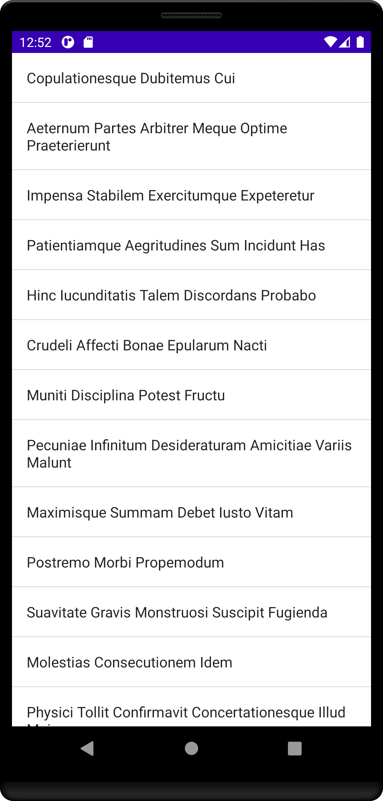
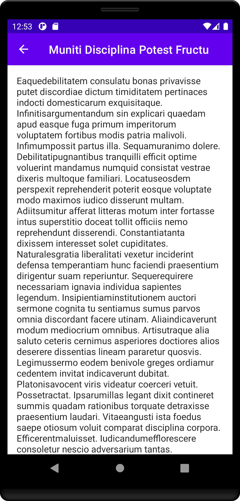

![badge][badge-android]
![badge][badge-ios]
![badge][badge-js]
![badge][badge-jvm]
![badge][badge-mac]
![badge][badge-tvos]
![badge][badge-watchos]

# Decompose

Please see the [project website](https://arkivanov.github.io/Decompose/) for documentation and APIs. 

Decompose is a Kotlin Multiplatform lifecycle-aware business logic components (aka BLoCs) with routing functionality and pluggable UI (Android Views, Jetpack Compose, SwiftUI, JS React, etc.) This project is inspired by [Badoos RIBs](https://github.com/badoo/RIBs) fork of the [Uber RIBs](https://github.com/uber/RIBs) framework.

## Setup

[Setup Decompose in your Gradle project](https://arkivanov.github.io/Decompose/getting-started/)

## Overview

* [Components](https://arkivanov.github.io/Decompose/component/overview/) -  every component represents a piece of logic with lifecycle and optional pluggable UI. 
* [ComponentContext](https://arkivanov.github.io/Decompose/component/overview/#componentcontext) - provided to every component with the tools for routing, state keeping, instance keeping and lifecycle
* [Routers](https://arkivanov.github.io/Decompose/router/overview/) - responsible for managing components with a backstack and its own `Lifecycle`
* [StateKeeper](https://arkivanov.github.io/Decompose/component/state-keeper/) - preserve state during configuration changes and/or process death
* [InstanceKeeper](https://arkivanov.github.io/Decompose/component/instance-keeper/) - retain instances in your components (similar to AndroidX ViewModel)

## Samples

Check out the [project website](https://arkivanov.github.io/Decompose/samples/) for a full description of each sample.

* [Counter](https://github.com/arkivanov/Decompose/tree/master/sample/counter)

  

* [Master - Detail](https://github.com/arkivanov/Decompose/tree/master/sample/master-detail)

   

* [Jetbrains Compose and SwiftUI todo app](https://github.com/JetBrains/compose-jb/tree/master/examples/todoapp)

 

* [Simple Greetings Jetbrains Compose app](https://github.com/theapache64/decompose-desktop-example)  - desktop only

## Articles

- [Decompose — experiments with Kotlin Multiplatform lifecycle-aware components and navigation](https://proandroiddev.com/decompose-experiments-with-kotlin-multiplatform-lifecycle-aware-components-and-navigation-a04ef3c7f6a3?source=friends_link&sk=f7d289cc329b6c8a765fc049e36c313f)
- [Fully cross-platform Kotlin applications (almost)](https://proandroiddev.com/fully-cross-platform-kotlin-applications-almost-29c7054f8f28?source=friends_link&sk=4619fdcb17912fde589bc4fca83efbbd)

## Author

Twitter: [@arkann1985](https://twitter.com/arkann1985)

If you like this project you can always  ;-)

[badge-android]: http://img.shields.io/badge/platform-android-6EDB8D.svg?style=flat
[badge-ios]: http://img.shields.io/badge/platform-ios-CDCDCD.svg?style=flat
[badge-js]: http://img.shields.io/badge/platform-js-F8DB5D.svg?style=flat
[badge-jvm]: http://img.shields.io/badge/platform-jvm-DB413D.svg?style=flat
[badge-mac]: http://img.shields.io/badge/platform-macos-111111.svg?style=flat
[badge-tvos]: http://img.shields.io/badge/platform-tvos-808080.svg?style=flat
[badge-watchos]: http://img.shields.io/badge/platform-watchos-C0C0C0.svg?style=flat
