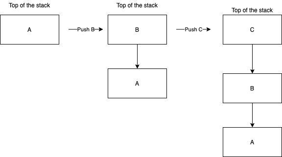
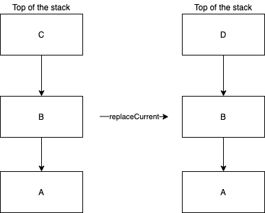

# Navigation

## Navigator & Router

All navigation in Decompose is done through the [`Navigator`](https://github.com/arkivanov/Decompose/blob/master/decompose/src/commonMain/kotlin/com/arkivanov/decompose/Navigator.kt) interface. This has one function called `navigate { }` which when called will transform the current stack with the provided lambda. 

!!! note
    The [`Router`](https://github.com/arkivanov/Decompose/blob/master/decompose/src/commonMain/kotlin/com/arkivanov/decompose/Router.kt) interface extends the `Navigator` interface. 

    

## Navigator Extensions

There are a few `Navigator` [extension functions](https://github.com/arkivanov/Decompose/blob/master/decompose/src/commonMain/kotlin/com/arkivanov/decompose/NavigatorExt.kt) that provide conveniences for navigating, some of which were already used in the [router overview example](../overview/#routing-example). 

The preceding examples will utilize the following sealed class & router for showcasing the usage of the `Navigator` extensions.

```kotlin
sealed class Configuration { 
    object A : Configuration()
    object B : Configuration()
    object C : Configuration()
    object D : Configuration()
}

val router: Router<Configuration>
```

### Push

Pushes the provided `Configuration` at the top of the stack. 

```kotlin
router.push(Configuration.B)
router.push(Configuration.C)
```



### Pop

Pops the latest configuration at the top of the stack. 

```kotlin
router.pop()
```


### Pop While 

Drops the configurations at the top of the stack while the provided predicate returns true. 

```kotlin
router.popWhile { topOfStack: Configuration -> topOfStack !is B }
```


### Replace Current

Replaces the current configuration at the top of the stack with the provided `Configuration`.

```kotlin
router.replaceCurrent(Configuration.D)
```



### Bring to Front 

Removes all components with configurations of the provided `Configuration`'s class, and adds the provided `Configuration` to the top of the stack. This is primarily helpful when implementing a Decompose app with [bottom navigation](https://github.com/arkivanov/Decompose/discussions/178)

!!! note
    The operation is performed as one transaction. If there is already a component with the same configuration, it will not be recreated.

```kotlin
router.bringToFront(Configuration.B)
```

