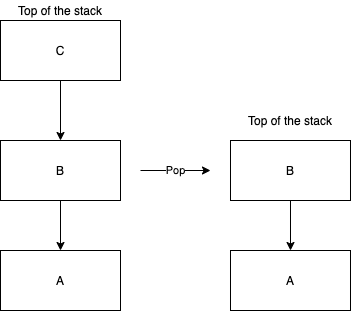
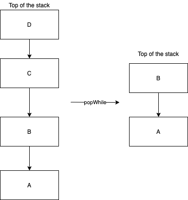
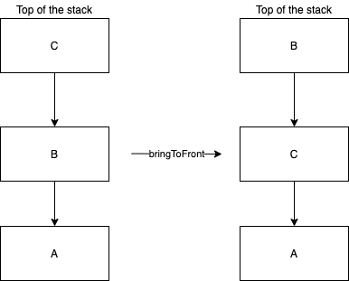

# Navigation

## Router

All navigation in Decompose is done through the [`Router`](https://github.com/arkivanov/Decompose/blob/master/decompose/src/commonMain/kotlin/com/arkivanov/decompose/router/Router.kt) interface. It has one function `navigate(transformer: (List<C>) -> List<C>)` which transforms the current stack of configurations into a new one by the provided `transformer` function. The stack is represented as `List`, where the last element is the top of the stack, and the first element is the bottom of the stack.

> ⚠️ The returned stack must not be empty.

The navigation is always performed synchronously during the `navigate` method call. The only exception to this rule is when the `navigate` method is called recursively. All recursive invocations are queued and performed one by one once the current navigation is finished.

During the navigation process, the `Router` compares the new stack of configurations with the previous one. The `Router` ensures that all removed components are destroyed, and that there is only one component resumed at a time - the top one. All components in the back stack are always either stopped or destroyed.

## Router extension functions

There are `Router` [extension functions](https://github.com/arkivanov/Decompose/blob/master/decompose/src/commonMain/kotlin/com/arkivanov/decompose/router/RouterExt.kt) that provide conveniences for navigating, some of which were already used in the [router overview example](../overview/#routing-example).

The preceding examples will utilize the following `sealed class` & `router` for showcasing the usage of the `Router` extensions.

```kotlin
sealed class Configuration {
    object A : Configuration()
    object B : Configuration()
    object C : Configuration()
    object D : Configuration()
}

val router: Router<Configuration>
```

### Push

Pushes the provided `Configuration` at the top of the stack.

```kotlin
router.push(Configuration.B)
router.push(Configuration.C)
```


### Pop

Pops the latest configuration at the top of the stack.

```kotlin
router.pop()
```



### Pop While

Drops the configurations at the top of the stack while the provided predicate returns true.

```kotlin
router.popWhile { topOfStack: Configuration -> topOfStack !is B }
```



### Replace Current

Replaces the current configuration at the top of the stack with the provided `Configuration`.

```kotlin
router.replaceCurrent(Configuration.D)
```


### Bring to Front

Removes all components with configurations of the provided `Configuration`'s class, and adds the provided `Configuration` to the top of the stack. This is primarily helpful when implementing a Decompose app with [bottom navigation](https://github.com/arkivanov/Decompose/discussions/178)

!!! note
    The operation is performed as one transaction. If there is already a component with the same configuration, it will not be recreated.

```kotlin
router.bringToFront(Configuration.B)
```


